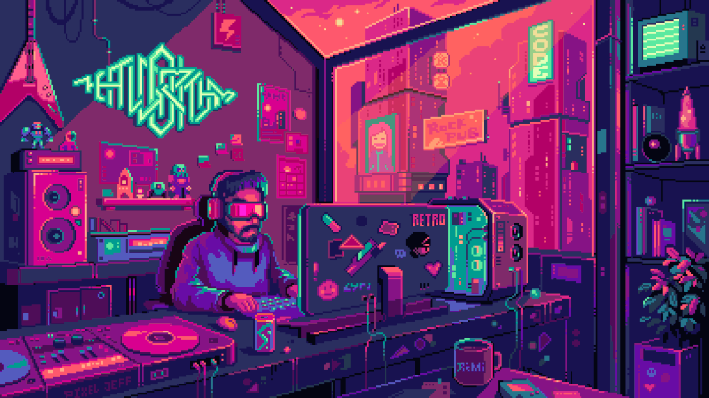

<h3 align='center'>Hello World!👋</h3>

<!--  -->
<!--  -->

<h1 align="center">I'm Draghetti Giacomo</h1>
<h3 align="center">A passionate frontend developer from Italy</h3>

  - 📄 Know about my experiences <a href='coverReadmeGithub/CV-Drafghetti-Giacomo.pdf'>CV</a>

  - ⚡ Fun fact I like go to the mountains for trekking, climbing and do snowboard

<h3 align="center">Connect with me:</h3>

  
📫 How to reach me jack.draghetti2002@gmail.com

<h3 align="center">Languages and Tools:</h3>

   
   
   
  
   
   
   
   
   
   
  

